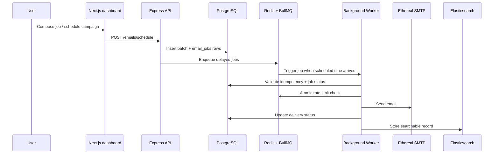

# ReachInbox Scheduler

A production-style full-stack project for scheduling and tracking bulk email sends, built with a Next.js frontend, Express API, PostgreSQL, Redis, and BullMQ background workers.

This project was designed to feel like a real SaaS product: OAuth sign-in, rate-limit enforcement, job orchestration, operational logging, and an admin dashboard for monitoring delivery workflows.

## Why this is a strong portfolio project

- End-to-end product workflow from login to scheduled email dispatch
- Real async worker architecture using Redis + BullMQ
- Production-minded patterns: idempotency, retry handling, queue reconciliation, and rate limiting
- Full-stack TypeScript application with a clean UI and API layer
- Demonstrates system design thinking, backend reliability, and operational awareness

## Tech stack

- Frontend: Next.js 15, React 19, TypeScript, Tailwind CSS
- Backend: Node.js, Express, TypeScript
- Data: PostgreSQL, Redis, Elasticsearch
- Queueing: BullMQ
- Auth: Google OAuth + JWT session flow
- Email: Nodemailer with Ethereal SMTP for local testing
- Ops: Docker Compose for local infrastructure

## Core features

- Google-based authentication and protected dashboard access
- Compose email modal for subject, body, recipients, scheduling, delay configuration, and per-sender limits
- Background queue processing for large outbound campaigns
- Per-sender rate limiting to prevent abuse and protect deliverability
- Job retry, delay scheduling, and status tracking across batches
- Elasticsearch indexing for search and operational visibility
- Slack integration for rate-limit alerts
- Admin queue monitoring for background job health

## Case study: building a reliable outbound email platform

### Problem

The biggest engineering challenge in this project was not building a UI, but designing a system that could safely process large numbers of scheduled outbound emails while staying within delivery and operational constraints.

A naive implementation would fail in a few common ways:

- duplicate sends caused by retries and restarts
- rate-limit violations from multiple workers firing simultaneously
- inconsistent state between the database and the queue
- poor observability when a batch stalls or fails in the background

### Architecture and flow



```text
Browser / Next.js Dashboard
        │
        ▼
Express API
        │
        ├── Google OAuth + JWT auth
        ├── Scheduling service
        ├── Queue publication to BullMQ
        └── Dashboard data retrieval
        │
        ▼
Redis + BullMQ
        │
        ▼
Worker process
        ├── idempotency checks
        ├── rate-limit enforcement
        ├── SMTP send
        ├── database status updates
        └── Elasticsearch indexing
        │
        ▼
PostgreSQL + Elasticsearch
```

### Design decisions and trade-offs

#### 1) PostgreSQL as the source of truth

I chose PostgreSQL for durable job state and campaign information because it gives transactional consistency and reliable recovery for status transitions.

Trade-off:
- Strong consistency and clearer auditability
- More read/write work than a pure in-memory queue system
- Requires explicit reconciliation after failures or restarts

#### 2) Redis + BullMQ for scheduling and async execution

BullMQ makes delayed dispatch, retry behavior, and worker coordination straightforward while keeping the queue durable enough for real use.

Trade-off:
- Excellent for async orchestration and backpressure
- Requires infrastructure discipline and operational monitoring
- Queue state is not the single source of truth; the database still matters for correctness

#### 3) Rate limiting in Redis

Per-sender limits were enforced with Redis-backed counters so workers could quickly decide whether a send should proceed without creating a hot DB bottleneck.

Trade-off:
- High performance and low contention for limit checks
- Slight increase in system complexity
- Redis state must be treated as operationally important, not just a cache

#### 4) Elasticsearch for search and visibility

Elasticsearch was treated as an operational read-optimized layer, not the system of record. This gives searchable delivery records without overloading the transactional database.

Trade-off:
- Better visibility and debugging
- Extra infrastructure to manage and maintain
- Strong eventual consistency compared with PostgreSQL

#### 5) Ethereal for local testing

Using Ethereal SMTP enables safe local testing and demonstration without accidentally sending real emails.

Trade-off:
- Great for demo reliability and safety
- Not suitable for production outbound delivery
- Makes the local environment feel more like a controlled sandbox than a live sender setup

### What I learned

The project improved my understanding of how a reliable queue-based system differs from a basic CRUD app:

- correctness depends on both the database and the queue being aligned
- retries and idempotency need explicit design, not default assumptions
- async systems are only trustworthy when visibility and failure recovery are part of the architecture

## Quick start

### 1) Start infrastructure

```bash
docker compose up -d
```

### 2) Configure environment variables

Backend:

```bash
cd backend
cp .env.example .env
```

Fill in the required values for:

- `JWT_SECRET`
- `GOOGLE_CLIENT_ID`
- `GOOGLE_CLIENT_SECRET`

Frontend:

```bash
cd frontend
cp .env.local.example .env.local
```

### 3) Install dependencies and run the app

From the project root:

```bash
npm install
npm run dev
```

This runs the backend and frontend in parallel.

For the full background worker flow, keep a second terminal open and run:

```bash
npm --prefix backend run worker
```

Then open:

- Frontend: http://localhost:3000
- API: http://localhost:4000
- Queue dashboard: http://localhost:4000/admin/queues

## Local setup details

### Required tools

- Node.js 18+
- Docker Desktop
- npm

### Services started by Docker

- PostgreSQL on port 5432
- Redis on port 6379
- Elasticsearch on port 9200

### Testing email delivery locally

The app integrates with Ethereal SMTP by default. When you log in with Google, it can auto-create a sender account for safe local email testing.

## Project highlights for resume / hiring context

- Built a full-stack distributed email workflow with queue-driven processing
- Designed around reliability constraints like retries, idempotency, and rate limiting
- Integrated authentication, scheduling, and operational monitoring into a cohesive product experience
- Applied system design and backend engineering concepts in a real application rather than a tutorial-only sample

## Repository structure

```text
.
├── backend/                  # Express API + BullMQ worker
├── frontend/                 # Next.js dashboard
├── docs/                     # project design and planning notes
├── docker-compose.yml        # local infra for Postgres, Redis, and Elasticsearch
├── package.json              # root scripts for local orchestration
├── README.md                 # project overview
├── LICENSE                   # MIT license
└── .gitignore
```

## License

This project is licensed under the MIT License. See the [LICENSE](LICENSE) file for details.

## Notes

This project is intentionally shaped as a product demo and engineering exercise, making it suitable for showcasing backend systems work, full-stack delivery, and practical asynchronous architecture in a GitHub portfolio.
end
local count = tonumber(current)
if count >= limit then
  return {0, count}
end
redis.call('INCR', key)
return {1, count + 1}
```

When the limit is hit:
- The idempotency Redis lock is **released** so the rescheduled job can re-acquire it.
- The job is **re-enqueued with `delay = ms until next UTC hour`** — emails are never dropped.
- PostgreSQL `scheduled_at` is updated to the new fire time.
- If Slack is connected, a notification is sent immediately.

**Min-delay throttle** — a second Lua script reads and writes a shared Redis key `email_worker:last_send_ts`, calculating the exact wait time needed before the next send. Because it runs in Redis, it is consistent across all concurrent worker instances.

**BullMQ limiter** — the worker also sets `limiter: { max: 1, duration: MIN_DELAY_MS }` at the BullMQ level as a secondary guard, ensuring the queue itself drains at the configured pace even before the in-worker throttle runs.

---

## Features Implemented

### Backend

| Feature | Details |
|---|---|
| **Email scheduling** | BullMQ delayed jobs; one job per recipient; delay formula preserves send order within a batch |
| **Persistence** | Redis AOF + named Docker volumes; jobs survive server/worker/container restarts |
| **Idempotency** | Short-lived Redis processing lock + PostgreSQL status check; sent/cancelled jobs are skipped |
| **Per-sender rate limiting** | Atomic Lua script; configurable limit; over-limit jobs rescheduled to next UTC hour, never dropped |
| **Min-delay throttle** | Redis shared timestamp; consistent across all concurrent worker instances |
| **Worker concurrency** | Configurable via `WORKER_CONCURRENCY`; BullMQ limiter as secondary guard |
| **Multiple SMTP senders** | Per-user Ethereal accounts stored in DB; user can add custom SMTP or create new Ethereal senders from the UI |
| **Google OAuth 2.0** | Passport.js strategy; JWT issued into an HTTP-only cookie on callback |
| **JWT auth middleware** | Reads token from `Authorization: Bearer` header or `cookie`; validates on every protected route |
| **Elasticsearch indexing** | Email documents indexed on schedule; status updated on send/fail; full-text search across subject, body, sender, recipient |
| **Slack OAuth + notifications** | OAuth flow stores webhook URL; `sendSlackNotification` uses webhook if present, falls back to `chat.postMessage` |
| **BullBoard** | Authenticated live queue dashboard at `/admin/queues`; shows delayed, waiting, active, completed, failed counts |
| **Graceful shutdown** | `SIGTERM`/`SIGINT` handlers close worker, queue, Redis, and DB connections cleanly |
| **Winston logging** | Structured JSON in production; colourised dev format; `logs/error.log` + `logs/combined.log` |
| **CSV / plain-text upload** | `multer` parses file upload; supports `.csv` (header detection) and `.txt` (newline/comma separated) |

### Frontend

| Feature | Details |
|---|---|
| **Google OAuth login** | Redirect to `/auth/google`; callback sets an HTTP-only cookie and AuthContext loads `/auth/me` |
| **Auth guard** | Dashboard redirects to `/login` if not authenticated; callback completes the cookie-based flow |
| **User profile in header** | Displays name, email, and avatar from the verified `/auth/me` response; logout clears the server cookie |
| **Stats bar** | Scheduled / Sent / Failed / Cancelled counts from `/emails/stats`; auto-refreshes every 10 s |
| **Scheduled tab** | Paginated table of pending jobs; auto-refreshes every 5 s; cancel button per row |
| **Sent tab** | Paginated table of sent/failed jobs; auto-refreshes every 15 s |
| **Elasticsearch search** | Search box in table header; queries `/emails/search?q=`; debounced |
| **Compose modal** | Subject, HTML body, CSV drag-and-drop or paste recipients, sender select, start time, delay, hourly limit |
| **Live email count** | Parses pasted text or reads CSV to show valid email count in real time |
| **Cancel scheduled email** | DELETE `/emails/:id`; removes BullMQ job and marks DB row cancelled |
| **Slack connect/disconnect** | Header button triggers OAuth flow; status shown; disconnect calls `POST /slack/disconnect` |
| **BullMQ Dashboard link** | Header link opens `/admin/queues` in a new tab |
| **Loading skeletons** | Shown while data fetches are in-flight |
| **Empty states** | Illustrated empty state when no emails exist |
| **Toast notifications** | `react-hot-toast` for success, error, and info messages |
| **TanStack React Query** | Caching, background refetch, invalidation on mutation |
| **Full TypeScript** | All components, API client, and types fully typed |

---

## API Reference

| Method | Path | Auth | Description |
|---|---|---|---|
| `GET` | `/health` | — | Health check |
| `GET` | `/auth/google` | — | Start Google OAuth |
| `GET` | `/auth/google/callback` | — | OAuth callback, issues JWT, redirects to frontend |
| `GET` | `/auth/me` | JWT | Current user from token |
| `POST` | `/auth/logout` | — | Clear token cookie |
| `POST` | `/emails/schedule` | JWT | Schedule a bulk email campaign |
| `GET` | `/emails/scheduled` | JWT | List scheduled emails (paginated) |
| `GET` | `/emails/sent` | JWT | List sent/failed emails (paginated) |
| `GET` | `/emails/search?q=` | JWT | Elasticsearch full-text search |
| `DELETE` | `/emails/:id` | JWT | Cancel a scheduled email |
| `GET` | `/emails/stats` | JWT | DB counts + live BullMQ queue counts |
| `GET` | `/emails/senders` | JWT | List SMTP senders for current user |
| `POST` | `/emails/senders` | JWT | Add a custom SMTP sender |
| `POST` | `/emails/senders/ethereal` | JWT | Create a new Ethereal test sender |
| `GET` | `/slack/connect` | JWT | Get Slack OAuth URL |
| `GET` | `/slack/callback` | — | Slack OAuth callback |
| `POST` | `/slack/disconnect` | JWT | Disconnect Slack |
| `GET` | `/slack/status` | JWT | Slack connection status |
| `GET` | `/admin/queues` | — | BullBoard live queue dashboard |

---

## Assumptions, Shortcuts & Trade-offs

**Idempotency key scope**  
Each recipient in a batch gets a fresh UUID generated at schedule time. If the same campaign (same subject+body+recipients) is scheduled twice, each scheduling creates new idempotency keys — intentional, since the user made a deliberate second request.

**Elasticsearch as search layer only**  
Elasticsearch is used purely for full-text search. PostgreSQL is the source of truth for job status, timestamps, and pagination. This avoids dual-write consistency problems: the ES document can lag slightly, but the DB is always correct.

**Rate limit rescheduling preserves relative order**  
When a sender's hourly limit is hit, the job is re-enqueued with `delay = ms until next UTC hour`. The original `i × delayBetweenEmailsMs` offset is preserved in `job.data`, so relative send order within a batch is maintained in the next window.

**BullBoard has no auth guard**  
`/admin/queues` is open in development. In production, add an `express-basic-auth` or JWT middleware in front of `serverAdapter.getRouter()`.

**JWT payload used for display only**  
The JWT contains `userId`, `email`, `name`, and `avatar` for client-side display. All database queries use the `userId` extracted from the verified JWT in the auth middleware — the payload is never trusted as-is for data access.

**Ethereal for email delivery**  
Ethereal is a fake SMTP sink. Emails are captured and never delivered to real inboxes, which is appropriate for a demo/test environment. Swapping to a real provider (SendGrid, SES, Postmark) requires only updating the SMTP credentials in the `email_senders` table — no code changes.

**No email templating engine**  
The `body` field accepts raw HTML or plain text. A real product would add Handlebars / Liquid templating, but that's out of scope for this assignment.

**Slack `chat.postMessage` fallback**  
If the Slack OAuth response does not include an `incoming_webhook` URL (e.g., the user selected a workspace without an existing webhook), the app falls back to `chat.postMessage` using the stored access token and channel ID. In practice the incoming webhook URL is almost always present when the `incoming-webhook` scope is requested.

**No test suite**  
Unit and integration tests were not included due to time constraints. The rate-limiter Lua script and idempotency logic are the most critical paths to test in a follow-up.
